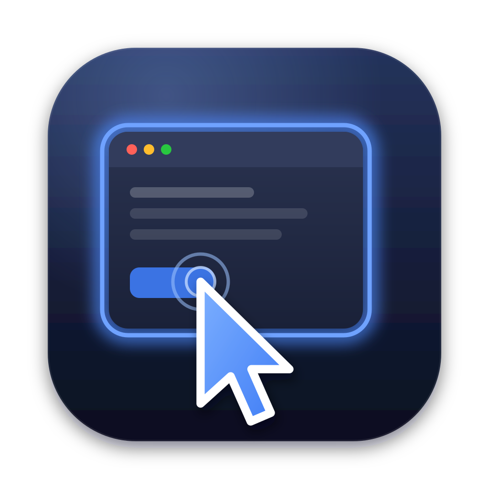

<p align="center"></p>

# OpenComputerUse

Computer use for agents that runs in the background, as an MCP server.
Start a session with an app and get back a session id. Drive the app with
that id, then end the session. The app works behind your other windows,
and your pointer, keyboard focus and frontmost app stay where they are.
Sessions end when the MCP server exits, including when it is killed.

## Tools

| Tool | What it does |
| --- | --- |
| `start_session` | Start an app (a `.app` path, bundle id or name on macOS; an executable elsewhere) and return a session id and its windows |
| `end_session`, `list_sessions`, `list_windows` | Manage sessions |
| `screenshot` | Capture a session window, even a covered one; `ui_tree: true` adds the accessibility tree |
| `get_ui_tree` | One line per element: `[e12] Button "Save" @(x,y wxh) actions=press` |
| `click`, `move_mouse`, `drag`, `scroll` | Pointer actions at window coordinates, or `click` with `element: "e12"` |
| `type_text`, `press_key` | Text, and chords such as `cmd+s` or `ctrl+shift+tab enter` |
| `set_value`, `element_action` | Set an element's value, or run press, focus, showmenu, increment and similar actions |
| `wait` | Let the app catch up |
| `run_recipe` | Run a fixed list of steps with a decision model (see below) |
| `permissions` | What the OS needs granted, and whether it is |

Every action returns a fresh screenshot unless you pass `screenshot: false`.
Pass `ui_tree: true` to also get the tree. Coordinates are points from the
window's top-left, the same grid as its screenshot.

## Recipes

`run_recipe` runs straight-line chores without the calling model in the
loop:

```json
{ "session_id": "…", "steps": [
  "click the address bar",
  "type \"example.com\" into the address bar",
  "press enter",
  { "click": "the More information link" }
] }
```

For each step, the runner sends the window's interactive elements to a
decision model as the options of one `choice` question. It acts on the
chosen element when the model is confident enough. There is no branching,
and the model generates no text. A step it cannot place stops the recipe and
returns a screenshot and the tree so the caller can take over. Two models
are supported, chosen in the app's settings:

- **TypeSafe Jev** (`api.typesafe.ai`, model `jev-latest`)
- **Cloudflare Clef / Clef-flash** on Workers AI (`@cf/cloudflare/clef-flash`)

## Platforms

Each platform implements the `Platform` and `Session` traits in
`crates/ocu-core`. Everything above them is shared: session ids, ownership,
cleanup, the MCP tools and recipes.

### macOS (`crates/ocu-macos`)

- **Launch:** apps open without activating. Your app's windows are put back
  on top, so the session window sits behind them.
- **Screenshots:** ScreenCaptureKit captures the window itself, so covered
  windows capture as they look.
- **Tree and element actions:** the Accessibility API, which works on
  background windows.
- **Pointer and keys:** posted to the app's process through SkyLight. The
  app is first told its window is active, without being raised; this
  "focus without raise" approach comes from yabai and trycua/cua.

The MCP server is a thin client. The **OpenComputerUse app** owns the
sessions, holds the Accessibility and Screen Recording permissions, and
draws a halo and a gliding cursor over the window being driven. It is built
with GPUI (the `IAmJSD/gpui` fork). The MCP server starts the app through
LaunchServices when needed, so the app keeps its own permissions whichever
client started the server. Opening the app shows its window:
permissions, one-click install into Claude Code, Claude Desktop, Codex or OpenCode, live sessions, and
recipe settings.

```sh
CODESIGN_IDENTITY="Developer ID Application: …" scripts/bundle-macos.sh   # universal (arm64 + x86_64)
cp -R dist/OpenComputerUse.app /Applications/ && open /Applications/OpenComputerUse.app
```

The icon is `assets/icon.svg`; `packaging/macos/icon.sh` rebuilds the `.icns` from it.

Sign the bundle with a real identity. An ad hoc signature changes on every
build, and macOS then asks for the permissions again.

### Linux (`crates/ocu-linux`)

- **Display:** each session gets a private Xvfb display with its own cookie.
  The app starts on it via `DISPLAY` and `XAUTHORITY`, with Wayland
  disabled.
- **Input and screenshots:** input goes through XTEST; screenshots read the
  framebuffer, so menus and popups are included.
- **Cleanup:** Xvfb and the app get `PR_SET_PDEATHSIG`, so they die with
  the server.
- **Where Xvfb is found:** `$OCU_XVFB`, next to the binary, or on `PATH`.
- **Not yet:** the accessibility tree (AT-SPI), so element actions and
  recipes are unavailable on Linux for now.
- **Watching a session:** connect a VNC server to its display, for example
  `x11vnc -display :N -auth <xauthority>`. The display and auth file are in
  the session details.

```sh
docker build -f scripts/linux/Dockerfile -t ocu-linux . && docker run --rm ocu-linux
```

### Windows (`crates/ocu-windows`)

- **Launch:** apps start suspended inside a kill-on-close Job Object, so
  their whole process tree dies with the server. They are shown without
  activating and sent to the back.
- **Screenshots:** `PrintWindow` with full-content rendering.
- **Input:** window messages posted to the control under the point, or to
  the focused control.
- **Tree and element actions:** UI Automation.

## Install with Homebrew

On macOS, install the app and the `opencomputeruse` command from the tap:

```sh
brew tap IAmJSD/OpenComputerUse https://github.com/IAmJSD/OpenComputerUse
brew install --cask opencomputeruse
opencomputeruse --version
```

The cask puts `OpenComputerUse.app` in `/Applications` and links the
`opencomputeruse` command into Homebrew's `bin`.

## Install into a client

From the app's window, or:

```sh
opencomputeruse install claude          # claude mcp add --scope user opencomputeruse -- <path> mcp
opencomputeruse install claude-desktop  # an "mcpServers" entry in claude_desktop_config.json
opencomputeruse install codex           # codex mcp add opencomputeruse -- <path> mcp
opencomputeruse install opencode        # an "mcp" entry in ~/.config/opencode/opencode.json(c)
opencomputeruse clients                 # which clients run this copy
```

Claude Desktop reads its config when it starts, so quit and reopen it after
installing. A client whose entry runs another copy (an old build, or the app before it
moved) shows as "points elsewhere"; installing again points it here.

For other clients, use `{ "command": "<path to opencomputeruse>", "args": ["mcp"] }`.

## Other devices (HTTP)

Off by default. Turn on **Serve over HTTP** in the app (or the local MCP
server's `http_server` tool) and other devices can drive this computer
through an HTTP API on port 8642, usually over Tailscale. While it is on, it
starts again at login, so it survives reboots.

Each device needs a key. **Generate Skill** asks for the device's name and the
URL it reaches this computer at (this computer's Tailscale name by default),
and gives back a `SKILL.md` to install on that device. The skill carries the
URL, the key and how to call every tool with curl. Keys are stored only as
hashes, so the skill is the one place a key appears. Devices are listed in
the app with **Regenerate Key** and **Remove**, and in the local MCP server
as `list_devices`, `generate_skill`, `regenerate_key` and `remove_device`.
Regenerating or removing a key ends that device's sessions. None of this
management is reachable over HTTP.

The API:

- `POST /v1/tools/<tool>` with JSON arguments returns `{content, isError}`,
  the same as an MCP tool call. `GET /v1/tools` lists the tools.
- `POST /mcp` is MCP over HTTP:
  `claude mcp add --transport http <name> <url>/mcp --header "Authorization: Bearer <key>"`.
- Every request needs `Authorization: Bearer <key>`, except `GET /health`.

There is no TLS, so use it over Tailscale or another trusted network. On
Linux and Windows, `opencomputeruse serve` runs the server, and
`serve --install` starts it at login.

## Settings

The settings file is at `opencomputeruse config-path`. On macOS it is
edited from the app. Elsewhere, edit it by hand or set `TYPESAFE_API_KEY`,
`CLOUDFLARE_ACCOUNT_ID`, `CLOUDFLARE_API_TOKEN` and `OCU_RECIPE_PROVIDER`.
Set `OCU_LOG=debug` for logs on stderr. The macOS agent logs to
`~/Library/Application Support/OpenComputerUse/agent.log`.

## Releasing

Bump `version` in `Cargo.toml`, commit, and push a matching tag (`v0.2.0`).
`.github/workflows/release.yml` builds the signed universal app
(`OpenComputerUse.zip` for the updater, `OpenComputerUse.dmg` for first
installs) and plain Linux and Windows binaries of the MCP server, then
publishes them as a GitHub release. The app checks for releases daily and from
its menu, and installs them in place when they are signed by the same team.

The macOS job signs and notarizes with these repository secrets, and builds
unsigned without them: `MACOS_CERT_P12_BASE64`, `MACOS_CERT_P12_PASSWORD`
(a Developer ID Application certificate), `APPLE_ID`,
`APPLE_APP_SPECIFIC_PASSWORD` and `APPLE_TEAM_ID`.

## Development

```sh
cargo test                                     # core, recipes and the updater
cargo run -p ocu-macos --example smoke         # drive TextEdit directly
python3 scripts/mcp_smoke.py                   # drive it through the MCP server
```

The widget kit in `src/agent/ui` comes from Schist (MIT; see
`LICENSE-SCHIST`).

## License

MIT, © 2026 Astrid Gealer. See [LICENSE](LICENSE).
